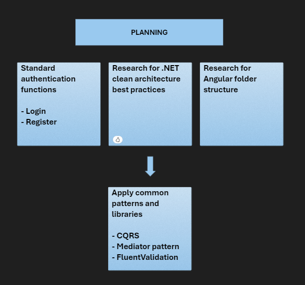
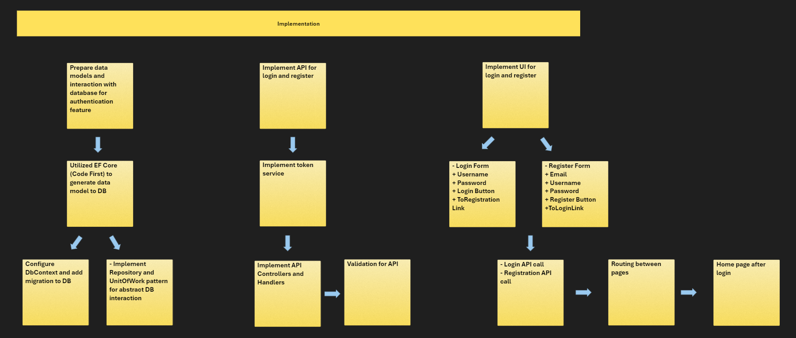

# .NET Core API Project Template with Clean Architecture

## **Workflow**




## **Folder Structure**

```
src/
  |-- MockProject.API/
  |     |-- Common/
  |     |-- Controllers/
  |     |-- Dtos/
  |     |-- Extensions/
  |     |-- Program.cs
  |
  |-- MockProject.Application/
  |     |-- Behaviours/
  |     |-- Commands/
  |     |-- Constants/
  |     |-- Enums/
  |     |-- Services/
  |     |-- DependencyInjection.cs
  |
  |-- MockProject.Domain/
  |     |-- Entities/
  |     |-- Repositories/
  |     |-- UnitOfWork.cs
  |
  |-- MockProject.Infrastructure/
  |     |-- Services/
  |     |-- DependencyInjection.cs
  |
  |-- MockProject.Persistence/
  |     |-- DataAccess/
  |     |-- Migrations/
  |     |-- Repositories/
  |     |-- UnitOfWork.cs
  |     |-- DependencyInjection.cs
  |
```

---

## **Dependency Flow**

1. **Domain**: No dependency on any other layer.
2. **Application**: Depends only on Domain.
3. **Infrastructure**: Depends on Application and Domain.
4. **API**: Depends on Application, Infrastructure, and Domain.

---

## **Libraries & pattern used**

1. Dependency injection **(DI)** to manage dependencies.
2. **MediatR** for implementing CQRS.
3. **EF Core** connecting to Database.
4. **FluentValidation** for Input Validation.  
5. **Repository** & **UnitOfWork** for data access abstraction. 
6. **JWT** for authentication. 

---